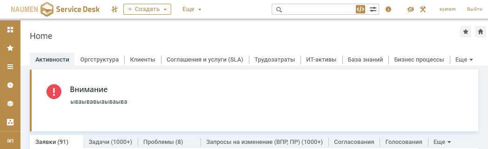

# ⚠️ SDAlert - Встроенное приложение NSD
Встроенное приложение для отображения важной информации в виде нативного алерта. Может быть размещен на любой карточке или форме в системе.

> Приложение еще не полностью автономно, для корректной работы необходим доступ к следующим хостам:
> * cdnjs.cloudflare.com
> * cdn.jsdelivr.ne

## Запуск приложения
>❗❗ Все настройки должны произвожиться знающими людьми в режиме технолога ❗❗

1. Установить модуль **alertRest.groovy** из папки **modules** на вашу платформу.
1. Добавить новое встроенное приложение, исполняемое на стороне клиента, и указать путь до архива с приложением.
1. Настроить высоту приложения *100-150px*

## To Do
- [x] Создание нативного интерфейса
- [x] Добавить поддержку темной темы
- [x] Добавить поддержку нескольких режимов алерта *(Danger, Warn, Info)*

## Скриншоты

Алерт на карточке компании